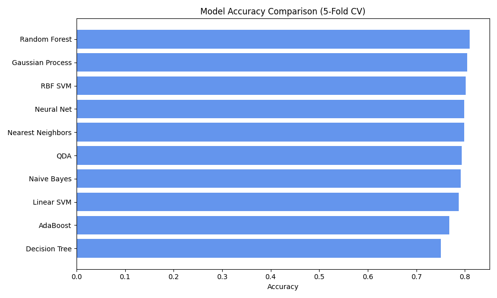

# 🚢 Titanic Survival Prediction

A machine learning project to predict passenger survival from the Titanic disaster using various classification algorithms. Built using Python, scikit-learn, and visualized with Matplotlib.  

## 📌 Problem Statement

Predict whether a passenger survived the Titanic shipwreck based on features like age, gender, passenger class, etc.

Dataset: [Kaggle Titanic Dataset](https://www.kaggle.com/competitions/titanic)

---

## 📊 Features Used

- `Pclass` – Ticket class
- `Sex` – Gender
- `Age` – Age in years
- `SibSp` – # of siblings/spouses aboard
- `Parch` – # of parents/children aboard
- `Fare` – Passenger fare
- `Embarked` – Port of Embarkation

---

## 🔧 Data Preprocessing

- Filled missing values (`Age`, `Embarked`)
- Dropped irrelevant features (`Name`, `Ticket`, `Cabin`)
- Encoded categorical variables (`Sex`, `Embarked`)
- Feature scaling using `StandardScaler`

---

## 🧠 Algorithms Used

Evaluated and compared 10 ML classifiers with cross-validation:

- K-Nearest Neighbors
- Linear SVM
- RBF SVM
- Gaussian Process
- Decision Tree
- Random Forest
- Neural Network (MLP)
- AdaBoost
- Naive Bayes
- QDA

---

## 📈 Results

| Classifier         | Accuracy (Cross-Validated) |
|--------------------|----------------------------|
| Random Forest      | 0.8104                     |
| Gaussian Process   | 0.8047                     |
| RBF SVM            | 0.8013                     |
| Neural Net         | 0.7992                     |
| Nearest Neighbors  | 0.7991                     |
| QDA                | 0.7935                     |
| Naive Bayes        | 0.7913                     |
| Linear SVM         | 0.7879                     |
| AdaBoost           | 0.7678                     |
| Decision Tree      | 0.7510                     |

🔍 *Accuracy scores are based on 5-fold cross-validation.*

---

## 📊 Visualization

---
